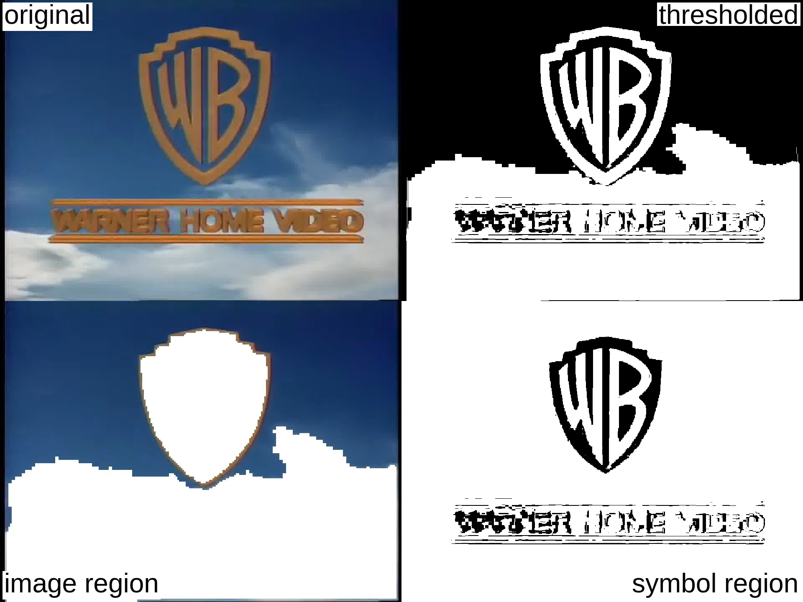

Uses the debug output of [jbig2enc](https://github.com/agl/jbig2enc),
a [JBIG2](https://en.wikipedia.org/wiki/JBIG2) image encoder,
to make a monochrome video effect similar to fax machine output.

See also:

https://github.com/bariumbitmap/tesseract-ocr-logo-video

https://github.com/agl/jbig2enc

## Explanation

The JBIG2 format is used for fax machines and bi-level images in PDFs. This
demonstrates part of the encoding process: a color image is thresholded to
remove a uniform background, then segmented into halftone image regions and
symbol regions. Symbol regions are compressed by creating a dictionary of
repeated symbols, usually letters. (More advanced encoders will use refinement
to reduce substitution errors.)

Example invocation of jbig2 command:

    jbig2 -O threshold.png -T 90 -S -j -b seg -s -a example.jpg > out.jb2
    # flags:
    # -O <outfile> : dump thresholded image as PNG
    # -T <bw threshold> : set 1 bpp threshold (default 188)
    # -S : remove images from mixed input and save separately
    # -j : write images from mixed input as JPEG
    # -b <basename>: output file root name when using symbol coding
    # -s : use text region, not generic coder
    # -a : use automatic thresholding in symbol encoder

## Links

https://vimeo.com/1214044131

https://www.youtube.com/watch?v=CVf3aEdnhQw
